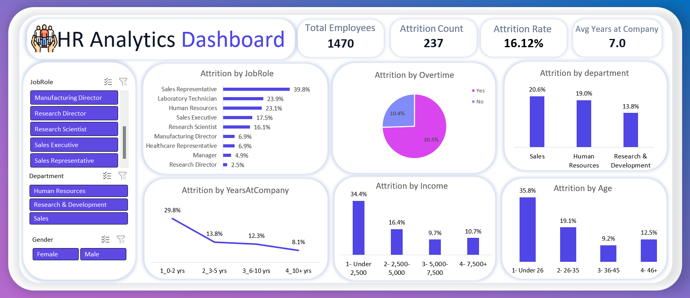

# HR Attrition Analysis — SQL + Excel

An end-to-end HR analytics project that investigates **why employees leave the company** using SQL for data querying and Excel for visualization. The project moves from raw data → SQL analysis → Excel pivot tables & dashboard → business recommendations.

---

## 📌 Project Overview

| | |
|---|---|
| **Goal** | Identify which employee groups are most likely to leave the company, and why |
| **Dataset** | IBM HR Analytics Employee Attrition & Performance (Kaggle) |
| **Size** | 1,470 employees · 35 original columns |
| **Tools** | SQL Server (SSMS), Microsoft Excel (Pivot Tables, PivotCharts, Dashboard) |
| **Type of analysis** | Cross-sectional (single point-in-time snapshot, not a time series) |

**Data source:** [IBM HR Analytics Employee Attrition & Performance — Kaggle](https://www.kaggle.com/datasets/pavansubhasht/ibm-hr-analytics-attrition-dataset)

---

## 🗂️ Repository Structure

```
├── SQL/
│   └── HR_Employees_Analysis.sql        # All analytical queries
├── Excel/
│   └── HR_Attrition_Dashboard.xlsx      # Raw data, pivot tables, dashboard
├── Screenshots/
│   ├── dashboard_overview.png
│   ├── attrition_by_department.png
│   ├── attrition_by_overtime.png
│   └── ...
└── README.md
```

---

## ⚙️ Workflow

1. **Data Import** — Imported the raw CSV into SQL Server (`HR-Employee-Attrition` table) to practice querying at scale.
2. **SQL Analysis** — Wrote 6 analytical queries to explore attrition patterns using `GROUP BY`, `CASE WHEN`, and `RANK() OVER()`.
3. **Excel Modeling** — Rebuilt the same analysis in Excel using Pivot Tables, plus engineered helper columns (`Left_Flag`, `AgeGroup`, `IncomeGroup`, `TenureGroup`) to simplify and speed up the pivoting.
4. **Dashboard** — Combined all charts into a single-page interactive dashboard with slicers (Department, Job Role, Gender).
5. **Business Interpretation** — Translated the numbers into prioritized, actionable recommendations (see below).

---

## 🧮 SQL Analysis

All queries run against the `HR-Employee-Attrition` table (1,470 rows, `Attrition` encoded as 1 = left, 0 = stayed).

### 1. Overall attrition rate
```sql
-- Goal: find the overall attrition percentage (how many employees left vs stayed)
SELECT 
    Attrition,
    COUNT(*) AS Employee_Count,
    CAST(COUNT(*) * 100.0 / (SELECT COUNT(*) FROM [HR-Employee-Attrition]) AS DECIMAL(5,2)) AS Percentage
FROM [HR-Employee-Attrition]
GROUP BY Attrition;
```
**Result:** 16.12% of employees left the company (237 out of 1,470).

### 2. Attrition rate by department
```sql
-- Goal: find the attrition rate per department, to see which department has the biggest turnover problem
SELECT 
    Department,
    COUNT(*) AS Total_Employees,
    SUM(CASE WHEN Attrition = 1 THEN 1 ELSE 0 END) AS Attrition_Count,
    CAST(SUM(CASE WHEN Attrition = 1 THEN 1 ELSE 0 END) * 100.0 / COUNT(*) AS DECIMAL(5,2)) AS Attrition_Rate
FROM [HR-Employee-Attrition]
GROUP BY Department
ORDER BY Attrition_Rate DESC;
```
**Result:** Sales (20.63%) > Human Resources (19.05%) > Research & Development (13.84%).

### 3. Salary & experience: leavers vs. stayers
```sql
SELECT attrition,
       AVG(MonthlyIncome) AS Avg_Monthly_Income,
       CAST(AVG(TotalWorkingYears*1.0) AS DECIMAL(5,2)) AS Avg_Working_Years
FROM [HR-Employee-Attrition]
GROUP BY Attrition;
```
**Result:** Employees who left earned less on average (~$4,787 vs. ~$6,832) and had less experience (~8.2 vs. ~11.9 years).

### 4. Overtime vs. attrition
```sql
SELECT OverTime,
       COUNT(*) AS Total_Employees,
       SUM(CASE WHEN Attrition = 1 THEN 1 ELSE 0 END) AS Attrition_Count,
       CAST(SUM(CASE WHEN Attrition = 1 THEN 1 ELSE 0 END) * 100.0 / COUNT(*) AS DECIMAL(5,2)) AS Attrition_Rate
FROM [HR-Employee-Attrition]
GROUP BY OverTime;
```
**Result:** Employees working overtime leave at **~3x the rate** of those who don't (30.53% vs. 10.44%) — the single strongest signal in the dataset.

### 5. Attrition rate by job role (ranked)
```sql
SELECT 
    JobRole,
    COUNT(*) AS Total_Employees,
    SUM(CASE WHEN Attrition = 1 THEN 1 ELSE 0 END) AS Attrition_Count,
    CAST(SUM(CASE WHEN Attrition = 1 THEN 1 ELSE 0 END) * 100.0 / COUNT(*) AS DECIMAL(5,2)) AS Attrition_Rate,
    RANK() OVER (
        ORDER BY SUM(CASE WHEN Attrition = 1 THEN 1 ELSE 0 END) * 100.0 / COUNT(*) DESC
    ) AS Attrition_Rank
FROM [HR-Employee-Attrition]
GROUP BY JobRole;
```
**Result:** **Sales Representative** is the highest-risk role by far (39.76%) — more than double the next-highest role.

### 6. Job satisfaction vs. attrition
```sql
SELECT 
    JobSatisfaction,
    COUNT(*) AS Total_Employees,
    SUM(CASE WHEN Attrition = 1 THEN 1 ELSE 0 END) AS Attrition_Count,
    CAST(SUM(CASE WHEN Attrition = 1 THEN 1 ELSE 0 END) * 100.0 / COUNT(*) AS DECIMAL(5,2)) AS Attrition_Rate
FROM [HR-Employee-Attrition]
GROUP BY JobSatisfaction
ORDER BY JobSatisfaction;
```
*(1 = Low, 2 = Medium, 3 = High, 4 = Very High)*

**Result:** A largely inverse relationship — attrition drops from 22.84% (Low satisfaction) to 11.33% (Very High satisfaction), with a small anomaly between Medium and High.

---

## 📊 Excel Dashboard

The same questions were rebuilt in Excel using PivotTables/PivotCharts, plus three engineered categorical columns (`AgeGroup`, `IncomeGroup`, `TenureGroup`) built with nested `IF()` formulas, and a `Left_Flag` helper column (`=IF(Attrition="Yes",1,0)`) that lets every pivot show attrition rate as a single `AVERAGE()`-based percentage instead of a Yes/No split.

**Dashboard includes:**
- 4 KPI cards: Total Employees, Attrition Count, Attrition Rate, Avg. Years at Company
- Attrition by Department, Job Role, Overtime, Years at Company, Monthly Income, Age Group
- Slicers: Job Role, Department, Gender



---

## 💡 Key Insights

| # | Finding |
|---|---|
| 1 | Overall attrition rate is **16.12%** (237 of 1,470 employees) |
| 2 | **Overtime is the strongest driver**: 30.5% attrition vs. 10.4% for non-overtime employees (~3x) |
| 3 | **Sales Representative** is the single highest-risk role (39.8% attrition) |
| 4 | **Sales** department has the highest attrition by department (20.6%) |
| 5 | Employees who leave earn **~30% less** and have **~4 fewer years** of experience on average |
| 6 | **New hires (0–2 years tenure)** leave at nearly 3x the rate of tenured employees (29.8% vs. ~8–14%) |
| 7 | Lower job satisfaction correlates with higher attrition, though not perfectly linearly |
| 8 | Gender shows only a small gap (~2–3 points) — not a meaningful risk factor on its own |

---

## ✅ Recommendations

> Framed as priorities, not a checklist — a real stakeholder needs one clear starting point, not five equally-weighted options.

**Priority 1 — Reduce overtime dependency**, especially in the Sales department. This is the fastest lever to pull (an internal operational decision, not one requiring new budget approval) and shows the largest effect size in the entire analysis.

**Priority 2 — Review compensation for new hires and Sales Representatives.** This requires Finance/HR input on actual cost-per-hire and salary bands before committing to numbers — the dataset shows *who* is at risk, not what a fix would cost.

**Note on scope:** This dataset is a single point-in-time snapshot, not a time series. Fields like `YearsAtCompany` describe tenure as of the data collection date, not attrition trends across calendar years.

---

## 🛠️ Tools Used
- **SQL Server / SSMS** — data querying, aggregation, window functions
- **Microsoft Excel** — Pivot Tables, PivotCharts, formulas (`IF`, nested `IF`), dashboard design

## 📎 Data Source
[IBM HR Analytics Employee Attrition & Performance Dataset — Kaggle](https://www.kaggle.com/datasets/pavansubhasht/ibm-hr-analytics-attrition-dataset)

